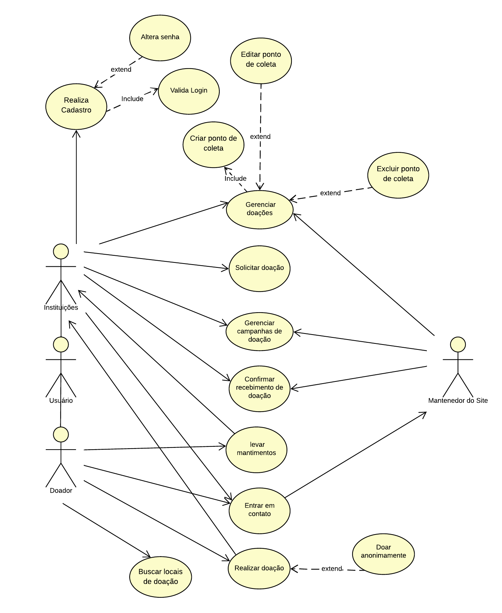

# Especificações do Projeto

Pré-requisitos: <a href="1-Documentação de Contexto.md"> Documentação de Contexto</a>

A definição exata do problema e os pontos mais relevantes a serem tratados neste projeto foi consolidada através de reuniões periódicas entre os integrantes do grupo praticando um brainstorming, trabalho de pesquisa em reportagens e publicações acadêmicas. Os detalhes levantados nesse processo foram consolidados na forma de personas e histórias de usuários.

## Personas

As personas levantadas durante o processo de entendimento do problema são apresentadas nas tabelas que se seguem.

<table border="1" width="70%">
<tr>
    <th></th>
    <td></td>
</tr>
<tr>
    <th rowspan="2"></th>  
    <td colspan="2" align="right"><b>Isabela</b> </td>
</tr>
<tr>
    <td><b>Idade:</b> 35    <b>Dificuldades:</b> Sua maior dificuldade foi encontrar um site que reúna pontos de coleta para doações de mantimentos próximos à sua residência

          
    </td> 
     
    <td><b>Em relação ao projeto: </b> Disse que usaria um site ou aplicativo que ajudasse pessoas em vulnerabilidade social a encontrarem pontos de distribuição gratuita de alimentos e refeições. O ponto de distribuição gratuita de alimentos deverá fornecer pontos de coleta para doações de mantimentos próximos a sua residência.
    </td>  
</tr>
</table>

<table border="1" width="70%">
<tr>
    <th></th>
    <td></td>
</tr>
<tr>
    <th rowspan="2"></th> 
    <td colspan="2" align="right"><b>Carlos</b></td>
</tr>
<tr>
    <td><b>Idade:</b> 19    <b>Dificuldades:</b> Sente que necessita ajudar a combater a fome no Brasil. Para isso, considera necessário ter um site que reúna todos os pontos de coleta para doação de mantimentos próximo de sua residência e próximo ao seu local de trabalho. Para ele, o site deve ser amigável, acessível e bem projetado.
        
    </td> 
    <td> <b>Em relação ao projeto:</b> Apresentou entusiasmo ao saber que vai ser desenvolvido um site que pode fornecer pontos de coleta para doações de mantimentos de forma permanente e não quando acontece algum tipo de catástrofe.
    </td>  
</tr>

<table border="1" width="70%">
<tr>
    <th></th>
    <td></td>
</tr>
<tr>
    <th rowspan="2"></th>
    <td colspan="2" align="right"><b>Juarez</b></td>
</tr>
<tr>
    <td><b>Idade:</b> 15    <b>Dificuldades:</b> Morador da periferia e ativista, sente que precisa fazer algo para amenizar o sofrimento da população em situação de vulnerabilidade social. Sente que precisa de um site que crie um mapa contendo pontos de mobilização social, que receba doações de alimentos e itens de necessidade básica.
        
    </td> 
    <td> <b>Em relação ao projeto:</b> Ficou super interessado e disse que usaria um aplicativo web que fornecesse ferramentas que viabilizassem a procura de pontos de coleta de doações.
    </td>  
</tr>

<table border="1" width="70%">
<tr>
    <th></th>
    <td></td>
</tr>
<tr>
    <th rowspan="2"></th>
    <td colspan="2" align="right"><b>Barbara</b></td>
</tr>
<tr>
    <td><b>Idade:</b> 60    <b>Dificuldades:</b> Precisa de um site seguro e transparente para realizar doações financeiras a uma instituição que distribui mantimentos.
        
    </td> 
    <td> <b>Em relação ao projeto:</b> Disse que usaria um site que fosse transparente e mostrasse para onde a sua doação estivesse indo.
    </td>  
</tr>
</table>

## Histórias de Usuários

Com base na análise das personas foram identificadas as seguintes histórias de usuários:

|EU COMO... `PERSONA`| QUERO/PRECISO ... `FUNCIONALIDADE` |PARA ... `MOTIVO/VALOR`                 |
|--------------------|------------------------------------|----------------------------------------|
|Isabella  | Um Site que forneça pontos de coleta para doações de mantimentos próximo a minha residência|  Para ajudar pessoas em vulnerabilidade social| 
|Carlos      | Pesquisar por locais próximos à minha residência e ao meu trabalho , para que eu possa doar alimentos                | Sente que necessita ajudar a combater a fome no Brasil.|
|Juarez |Um site que contenha um mapa com pontos de mobilização social e que receba doações de alimentos e itens de necessidade básica.       | Sente que precisa ajudar as pessoas que possuem vulnerabilidade social , principalmente realizando doações de itens de necessidade básica |
|Barbara |Um site seguro e transparente para realizar doações financeiras a uma instituição que distribui mantimentos.| Ajudar o próximo através de doações financeiras|

## Requisitos

A tabela a seguir apresenta os requisitos funcionais do projeto, identificando suas respectivas prioridades de entrega.

### Requisitos Funcionais

|ID    | Descrição do Requisito  | Prioridade |
|------|-----------------------------------------|----|
|RF-001| O sistema deve permitir que a instiuição se cadastre na aplicação  | ALTA | 
|RF-002| o sistema deve permitir que a instituição valide o login | ALTA |
|RF-003| O sistema deve permitir que a instituição altere a senha do login   | ALTA | 
|RF-004| O sistema deve permitir que a instituição  crie um ponto de coleta de doações  | ALTA |
|RF-005| O sistema deve permitir que a instituição edite um ponto de coleta de doações  | MÉDIA | 
|RF-006| O sistema deve permitir que a instituição exclua um ponto de coleta de doações  | MÉDIA| 
|RF-007| O sistema deve apresentar funcionalidades para que as instituições e o mantenedor do site possam gerenciar as doações.   |ALTA |
|RF-008| O sistema deve apresentar funcionalidades para que as instituições e o mantenedor do site possam gerenciar as campanhas de doações.   |ALTA |
|RF-009| O sistema deve conter uma notificação para confirmar o recebimento de doações | ALTA | 
|RF-010| O sistema deve apresentar uma funcionalidade para a instituição solicitar doações | ALTA | 
|RF-011| O sistema deve apresentar a possibilidade do próprio usuário entregar as doações   | BAIXA|
|RF-012| O sistema deve apresentar a possibilidade de buscar locais de doação   | ALTA |
|RF-013|O sistema deve conter uma página de "Fale com Nosso Encarregado de Dados" (DPO) atendendo à LGPD, contendo um formulário colhendo nome, e-mail, telefone, assunto e texto  | BAIXA | 
|RF-014| O sistema deve  permitir que o doador seja anônimo, escolhendo o banco ou a chave pix para realizar o depósito sem identificar-se  | ALTA |
|RF-015| O sistema deve permitir que o usuário realize suas doações.| ALTA | 
|RF-016| O sistema deve permitir que as doações possam ser feitas com cartão de crédito através de um sistema de pagamento| ALTA | 

### Requisitos não Funcionais

A tabela a seguir apresenta os requisitos não funcionais que o projeto deverá atender, identificando suas prioridades de entrega.

|ID     | Descrição do Requisito  |Prioridade |
|-------|-------------------------|----|
|RNF-001| O site deve ser publicado em um ambiente acessível publicamente na Internet (GitHub Pages).  | ALTA | 
|RNF-002| O site deve ser responsivo, permitindo a visualização em um celular, desktop, tablet de forma adequada.  |  ALTA | 
|RNF-003| O site deve ter bom nível de contraste entre os elementos da tela em conformidade.    | MÉDIA | 
|RNF-004| O site deve ser compatível com os principais navegadores do mercado (Google Chrome, Firefox, Microsoft Edge).     | ALTA |
|RNF-005| O desenvolvimento front-end deve ser em HTML, CSS, Javascript, podendo utilizar frameworks. | MÉDIA | 
|RNF-006| O sistema back-end deve ser desenvolvido na linguagem C#, podendo utilizar frameworks.|ALTA |
|RNF-007| O banco de dados utilizado é o MySQL.  | MÉDIA | 
|RNF-008| O site deve ter pontuação acima de 50 no requisito “Desempenho”, verificado pelo Lighthouse no navegador Google Chrome.  | MÉDIA |
|RNF-009| O site deve ter pontuação acima de 50 no requisito “Práticas Recomendadas”, verificado pelo Lighthouse no navegador Google Chrome.  | MÉDIA | 
|RNF-010| O site deve ter pontuação acima de 70 no requisito “Acessibilidade”, verificado pelo Lighthouse no navegador Google Chrome.  | MÉDIA |
|RNF-011| O site deve apresentar a funcionalidade que permita o usuário alterar o tamanho da letra. | MÉDIA | 
|RNF-012| O site deve apresentar imagens que auxiliem o entendimento do leitor para cada assunto exposto no corpo da página. | MÉDIA | 
|RNF-013| O site deve apresentar a funcionalidade de modificar o tamanho da imagem através da tecla ALT.  | MÉDIA | 
|RNF-014| O site deve permitir visualizar as informações de contatos da(s) pessoa(s) que criaram o site e o mantém. | MÉDIA | 
|RNF-015| O site deve apresentar em todas as páginas, no footer, a logo marca oficial, políticas de privacidade e termos de uso. | MÉDIA | 

## Restrições

As restrições podem ser explicadas como tarefas que limitam e comprometem a execução e o desenvolvimento do projeto, servindo como marco delimitador daquilo que precisará ser realizado para que o projeto seja considerado pronto.  

 A tabela abaixo, apresenta as seguintes restrições do projeto. 

|ID| Restrição                                             |
|--|-------------------------------------------------------|
|01| O site deve restringir as tecnologias de Front-End e Back-End, podendo conter API’s.  |
|02| O site deve ter a homologação das fases de testes (QA) e operação assistida antes do processo de subida para produção.      |
|03| O site deve conter a documentação técnica (Solution Design Document) para facilitar a equipe de suporte em futuros ajustes no código.  |
|04| O site deverá ficar restrito a um único idioma, que será o “pt-br” (português).        |
|05| O site deve ser entregue até o dia 11/12/2022.|
|06| O site deve ser publicado no GitHub.       |

## Diagrama de Casos de Uso

<tr>
    <th rowspan="2"></th>
    
</tr>

