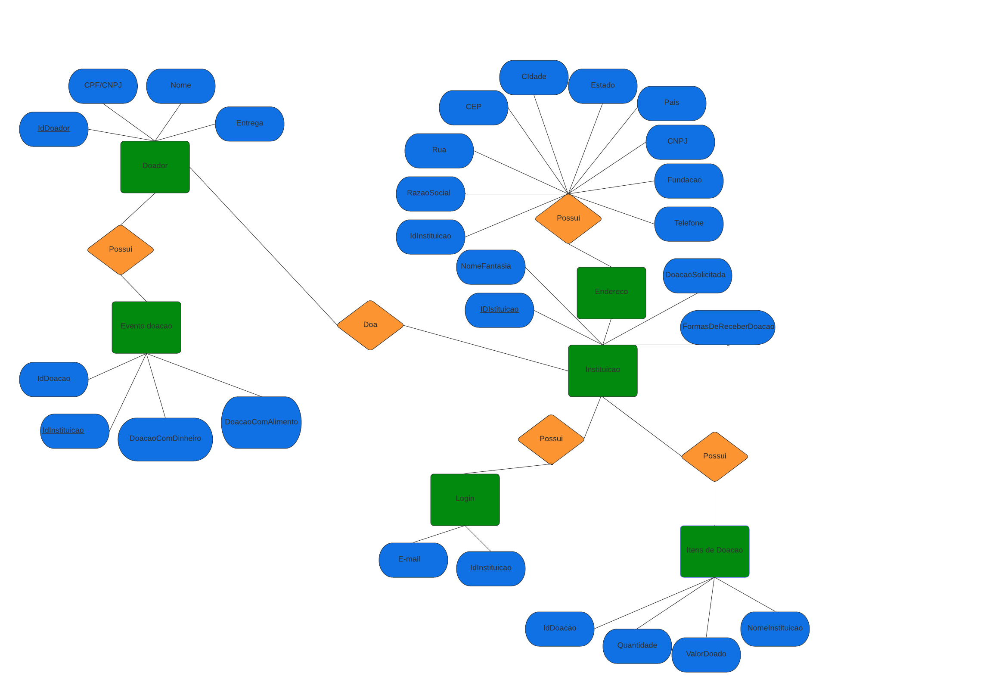
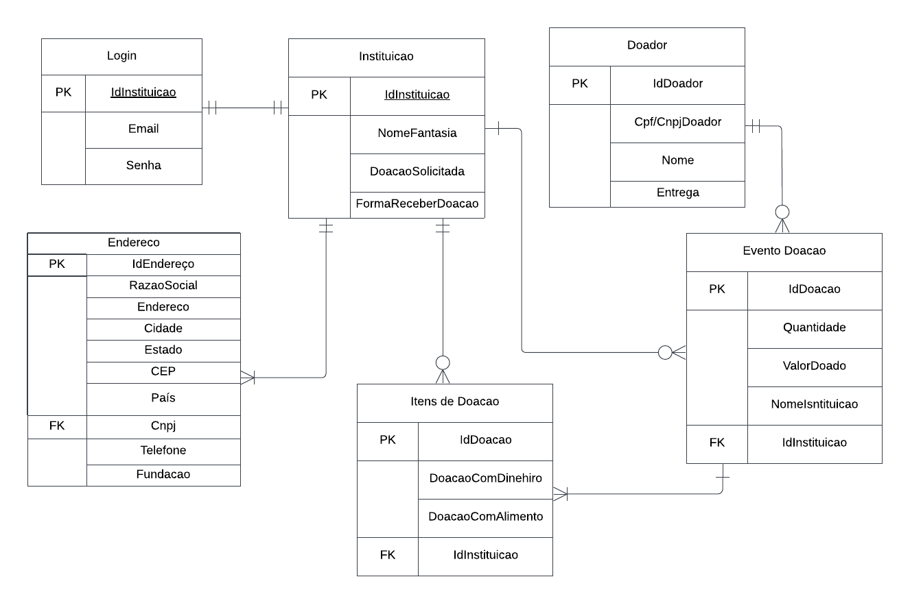

# Arquitetura da Solução

Pré-requisitos: <a href="3-Projeto de Interface.md"> Projeto de Interface</a>

Definição de como o software é estruturado em termos dos componentes que fazem parte da solução e do ambiente de hospedagem da aplicação.

## Diagrama de Classes

## Modelo ER (Projeto Conceitual)

## Projeto da Base de Dados

## Tecnologias Utilizadas

- Editor de código: vscode
- Ferramentas de comunicação: teams e discord
- Ferramenta para desenho de tela: Figma
- Criação do documento: Google Docs
- Gerenciamento do Projeto: Github Projects
- Repositório do código fonte: Github

O editor de código foi escolhido porque ele possui uma integração com o sistema de versão. As ferramentas de comunicação utilizadas possuem integração semelhante e por isso foram selecionadas. Por fim, para criar diagramas utilizamos essa ferramenta por melhor captar as necessidades da nossa solução.

Por se tratar de uma ferramenta de trabalho em equipe, escolhemos o google docs como local de produção do documento. Para gestão do projeto e repositório remoto, escolhemos o GitHub pela integração com a universidade.

## Hospedagem

O site utiliza a plataforma do Github Pages como ambiente de hospedagem do site do projeto. O site é mantido no ambiente da URL:

https://github.com/ICEI-PUC-Minas-PMV-ADS/pmv-ads-2022-2-e2-proj-int-t5-projeto-contra-fome
