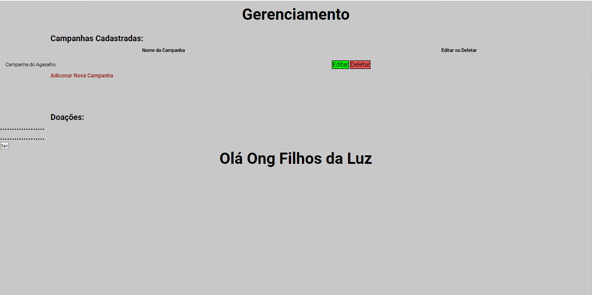

# Programação de Funcionalidades

Nesta seção é apresentada a tela de login e cadastro, duas  funcionalidades do sistema. O respectivo endereço (URL) e outras orientações de acesso são apresentadas na sequência. 

## Visualização da tela de Login

A tela principal apresenta diversas funcionalidades que estarão descritas separadamente nas próximas visualizações de telas. na tela de login temos estruturas de dados baseada em HMTL e CSS. Exemplo da tela de Login:

### Instruções de acesso 

1.	Abra um navegador de Internet e informe a URL  http://127.0.0.1:5500/src/Projeto%20autenticação
2.	Abrirá a página de login

## Visualização da tela de Cadastro 

O Cadastro apresenta diversas funcionalidades que estarão descritas separadamente nas próximas visualizações de telas. Na página de Cadastro temos estruturas de dados baseada em HMTL e CSS. Exemplo de tela de Cadastro:

### Instruções de acesso 

1.	Abra um navegador de Internet e informe a URL http://127.0.0.1:5500/src/Projeto%20autenticação

### Gerenciamento de Campanhas Cadastradas

1.	Abra um navegador de Internet e informe a URL http://127.0.0.1:5500/src/Projeto%20autenticação