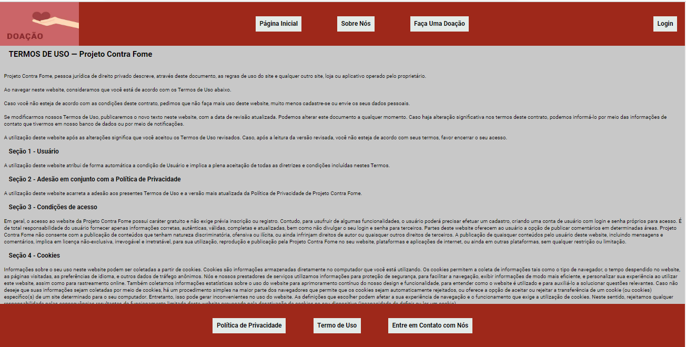

# Registro de Testes de Software

Esta seção apresenta as evidências e resultados dos testes definidos anteriormente em Plano de Testes de Software.

## CT-01 – TESTE DE NAVEGABILIDADE

Discorra sobre os resultados do teste. Ressaltando pontos fortes e fracos identificados na solução. Comente como o grupo pretende atacar esses pontos nas próximas iterações. Apresente as falhas detectadas e as melhorias geradas a partir dos resultados obtidos nos testes.

# Evidências do Teste:

# Navegabilidade Página Inicial

# Navegabilidade sobre nós

# Faça uma Doação

# Política de Privacidade

# Termo de Uso

# Entre em Contato com Nós

# Login

# Cadastre

# Avaliação: As paginas representam as informações e navegabilidade entre elas

## Teste de login 1- 2 – TESTE DE LOGIN
  
# Teste1 - Realizar Login  

# inserindo dados para login

# usuário logado

# Caso de insucesso 

## Teste2 - Teste de Cadastro de Instituição

# Preencher os dados da instituição

Caso de sucesso:

Caso de insucesso:

