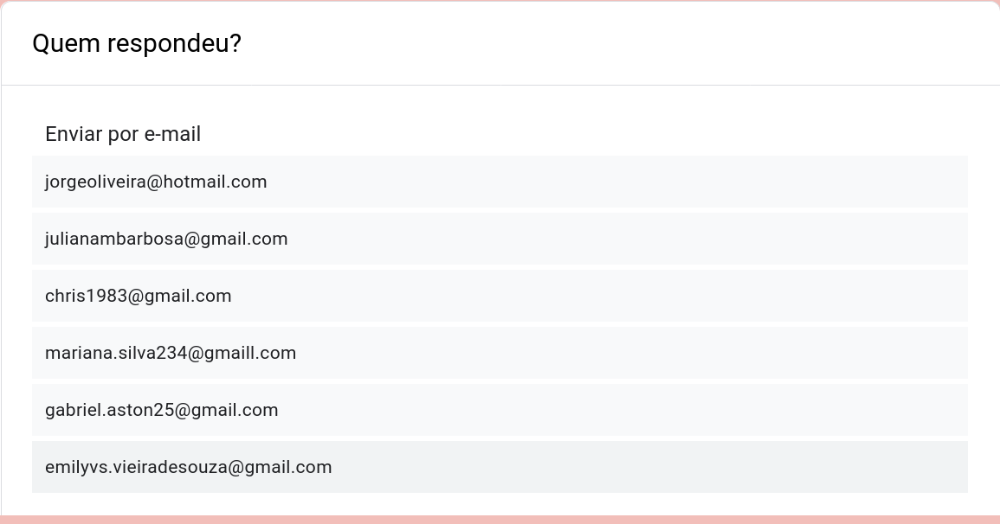
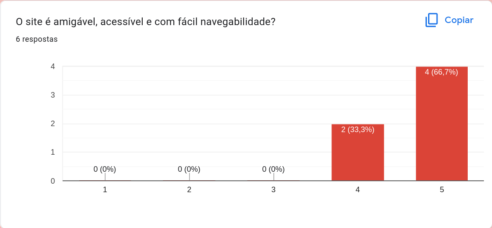
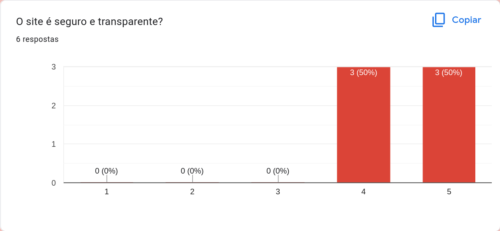
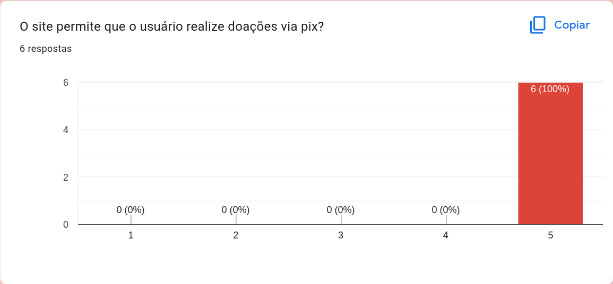
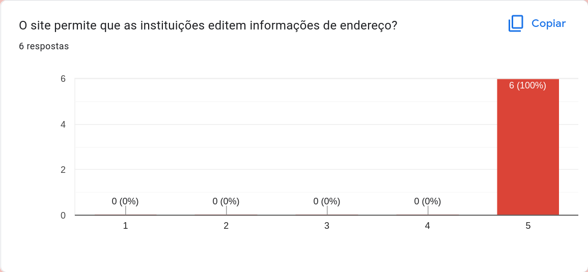
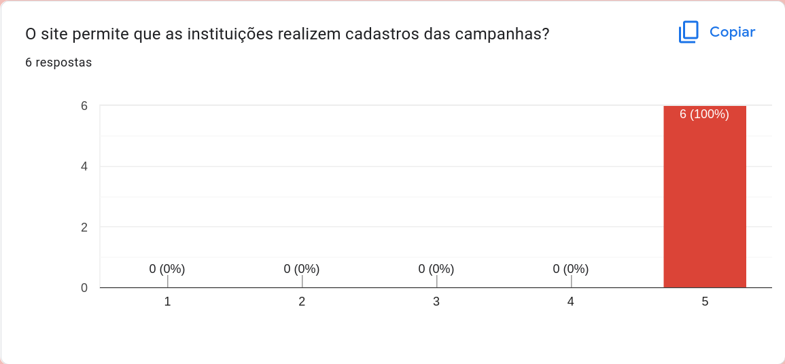
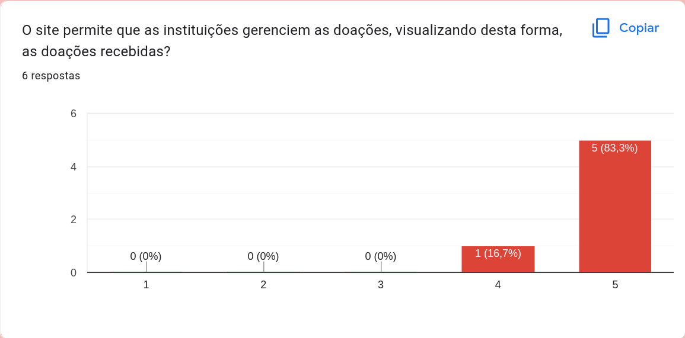

# Registro de Testes de Usabilidade

Para realização dos testes, as pessoas selecionadas receberam e responderam <a href="https://docs.google.com/forms/d/122Cq8gASSf8S_1LxN6TtEBGT53ViA2vDa1VL8xXrUPo/prefill"> o formulário para medir a usabilidade</a> 

O formulário serve para medir a usabilidade do site com informações sinceras do projeto.

Os relatórios abaixo fazem o registro dos participantes e indicam a satisfação dos usuários, em cada tarefa. 
**Registro dos Usuários que participaram do teste:**

## Tarefas:

Os dados abaixo informam as respostas dos participantes.

